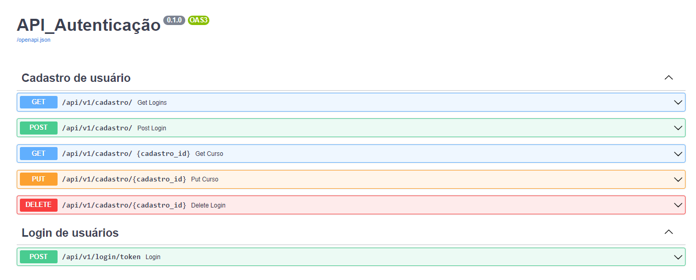

# Projeto API Autenticação.

Nesse repositório contém um projeto realizado com python assíncrono e o framework
FastAPI.

O projeto consiste em um sistema de autenticação de usuários.

exemplos:

- Rotas para cadastrar usuários (CRUD);
- Rotas para o usuário cadastrado realizar o login.

### Pré-requisitos

- Python
- O banco de dados é de sua escolha, mas nesse projeto utilizei o PostgreSQL e a lib sqlalchemy
- Instalação do requeriments.txt disponibilizado.

### Exemplos das rotas criadas:

